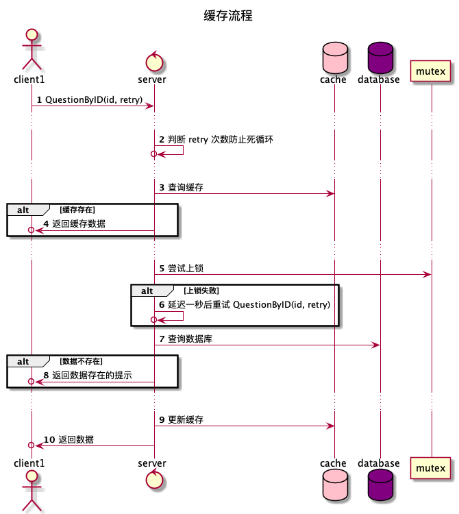
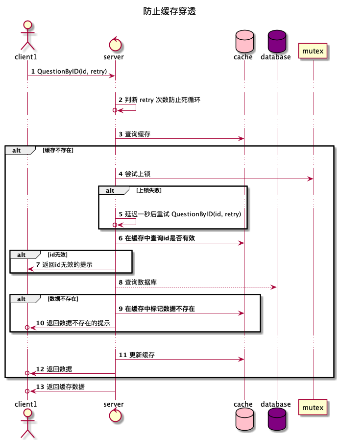
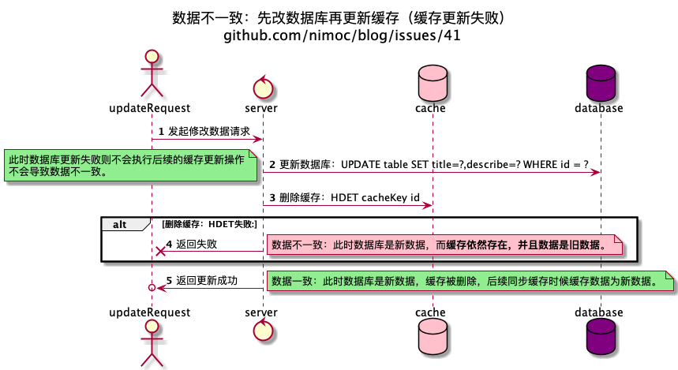

----

title: 缓存实践
date: 2021-02-27
tags: 后端
issues: 41

----

# 缓存实践

[](https://nimoc.io/notice/)

## Cache Aside（边路缓存）

### 不使用缓存

例如我们在开发提问系统，提问访问量非常大，每秒一万次访问。

最开始的伪代码如下：

```javascript
function QuestionByID(id) {
  row = SQLQuery("SELECT title, describe FROM question WHERE id = ? LIMIT 1")
  if row == null {
    return {
      type: "fail",
      msg : "数据不存在"，
    }
  }
  return {
    title: row.title,
    describe: row.describe,
  }
}
```

上线后发现数据库压力过大，服务延迟非常高，

## 使用缓存

为了解决次问题，使用缓存减少频繁的 sql 操作。

缓存设计方式如下：

```
第一个请求：查询缓存 > 缓存不存在 > 查询数据库 > 将数据写入缓存 > 响应数据
第二个请求：查询缓存 > 缓存存在 > 响应数据
```


修改后的伪代码如下：

```javascript
function QuestionByID(id) {
  cacheKey = "question:" + id
  cache = Redis("HGETALL", cacheKey, )
  // 判断缓存是否存在
  if (cache == nil) {
    // 查询数据库
    row = SQLQuery("SELECT title, describe FROM question WHERE id = ? LIMIT 1")
    if row == null {
      return {
        type: "fail",
        msg : "数据不存在"，
      }
    }
    // 将数据库的数据同步到缓存
    Redis(
        "HSET", cacheKey,
        "title", row.title,
        "describe", row.describe,
        "cache_expire_uinx_seconds", time.Now().Add(time.Secound*120).Unix()) row.describe,
    )
    // 响应数据
    return {
      title: cache.title,
      describe: cache.describe,
    }
  }
  // 响应缓存数据
  return {
    title: cache.title,
    describe: cache.describe,
  }
}
```


> redis hash 的 feild 无法设置过期时间，可以通过定时任务使用 hscan 去检测 cache_expire_uinx_seconds 来实现 field 过期时间


### 缓存击穿

重新发布后，数据库压力大幅度减少。但部分新问题发布后还是会出现几秒短暂的sql连接数暴增。

原因是一些粉丝量很大的用户发布提问后大量用户涌入，在缓存还没来得及同步时出现大量sql查询。这种情况叫**缓存击穿**

为了解决这种情况，需要使用分布式互斥锁避免出现一个提问出现大量同步缓存操作。

> 分布式互斥锁需要保证上锁和解锁都是原子性，在解锁时不要意外的解锁了其他线程/协程/机器上的锁和处理解锁时锁过期。本文不深入互斥锁。[互斥锁文章](https://github.com/search?q=user%3Animoc+%E4%BA%92%E6%96%A5%E9%94%81)


```
第一个请求：查询缓存 > 缓存不存在 > 尝试上锁 > 上锁成功 > 查询数据库 > 将数据写入缓存 > 响应数据
第一个请求：查询缓存 > 缓存不存在 > 尝试上锁 > 上锁失败 > 延迟1秒后重试查询
第二个请求：查询缓存 > 缓存存在 > 响应数据
```





修改后的伪代码如下：

```javascript
function QuestionByID(id string, retry int) {
  // （可暂时跳过这一段 if 代码）为防止意外多次重试出现死循环，增加中断条件
  if (retry > 2) {
    return {
      type: "fail",
      message: "提问获取失败，请重试。"
    }
  }
  cacheKey = "question:" + id cache = Redis("HGETALL", cacheKey, )

  if (cache == nil) {
    // 互斥锁
    lockKey = "question_sync_cache:" + id lockSuccess,
    Unlock = Lock(lockKey, {
      ExpireSeconds: 3
    }) if (lockSuccess == false) {
      // 锁被占用时等待1秒
      SleepSeconds(1)
      // 再次调用 QuestionByID 重试查询，因为根据测试结果1秒的时间足够同步缓存完成。
      return QuestionByID(id, retry + 1)
    }

    row = SQLQuery("SELECT title, describe FROM question WHERE id = ? LIMIT 1")
    if row == null {
      return {
        type: "fail",
        msg : "数据不存在"，
      }
    }
    Redis("HSET", cacheKey, "title", row.title, "describe", row.describe, "cache_expire_uinx_seconds", time.Now().Add(time.Secound*120).Unix())
    unlockSuccess = Unlock()
    // 解锁失败
    if (unlockSuccess == false) {
      // 再次调用 QuestionByID 重试查询
      return QuestionByID(id, retry + 1)
    }
    return {
      title: cache.title,
      describe: cache.describe,
    }
  }
  return {
    title: cache.title,
    describe: cache.describe,
  }
}
```


当有新提问被大量并发访问时，只有一个请求会进入查询 SQL的逻辑，其他请求会等待一秒后重试。如果第一个请求因为各种原因导致没有能成功更新缓存，还会有其他请求重新加锁并更新缓存。

在一种极端情况下：有出现大量的请求，成功上锁的那一个请求在上锁后因为各种原因线程中断了，导致没有解锁。此时会出现3秒内所有 QuestionByID 都不能响应数据。但这种情况出现的几率非常小，可根据业务场景来判断是否可以忽略。

### 缓存穿透

发布运行一段时间后一切正常，偶尔有一天发现当粉丝量很大的用户发布提问后又理解删除提问。发布提问时候推送消息已经推送到很多用户的手机中，用户阅读消息并点击访问提问。会进入如下流程：


如图所示，所有的用户请求都进入了红色框线路。即使在同步缓存时使用互斥锁去减少数据库压力。在第一个上锁成功的用户没查到数据并解锁后还会有新的用户上锁>查询数据库->响应无数据。这就导致了**缓存穿透**

> 数据不存在原因可能是正常删除，也可能是意外删除，也可能是恶意攻击。

为了解决缓存穿透，需要在查询到不存在的数据时在缓存中标记数据不存在，以避免缓存穿透。




```js
function QuestionByID(id string, retry int) {
  // （可暂时跳过这一段 if 代码）为防止意外多次重试出现死循环，增加中断条件
  if (retry > 2) {
    return {
      type: "fail",
      message: "数据获取失败，请重试。"
    }
  }
  cacheKey = "question:" + id cache = Redis("HGETALL", cacheKey, )

  if (cache == nil) {
    // 在缓存中查询是否是无效数据
    invalid = RedisCommand("HGET", "question_invalid", id)
    if (invalid) {
      return {
        type: "fail",
        msg : "数据不存在"，
      }
    }
    lockKey = "question_sync_cache:" + id lockSuccess,
    Unlock = Lock(lockKey, {
      ExpireSeconds: 3
    }) if (lockSuccess == false) {
      SleepSeconds(1)
      return QuestionByID(id, retry + 1)
    }

    row = SQLQuery("SELECT title, describe FROM question WHERE id = ? LIMIT 1")
    if row == null {
      // 标记无效数据
      invalid = RedisCommand("HSET", "question_invalid", id, time.Now().Add(time.Secound*120).Unix())
      // 值设为无效标记超时时间，便于 HSCAN 清除数据
      return {
        type: "fail",
        msg : "数据不存在"，
      }
    }
    Redis("HSET", cacheKey, "title", row.title, "describe", row.describe, "cache_expire_uinx_seconds", time.Now().Add(time.Secound*120).Unix())
    unlockSuccess = Unlock()
    if (unlockSuccess == false) {
      return QuestionByID(id, retry + 1)
    }
    return {
      title: cache.title,
      describe: cache.describe,
    }
  }
  return {
    title: cache.title,
    describe: cache.describe,
  }
}
```

当数据量非常大时 hash 存储无效id会导致缓存数据过大，可以使用[布隆过滤器](https://www.dogedoge.com/results?q=%E5%B8%83%E9%9A%86%E8%BF%87%E6%BB%A4%E5%99%A8) 降低缓存大小。可以根据实际情况选择合适的方式。

### 更新数据时同步缓存

更新数据时同步缓存,需要通过删除缓存从而让后续的用户请求触发同步缓存来实现。
如果直接设置缓存的值`HSET cacheKey ....` 在并发情况下非常容易出现数据不一致的问题。

先列出记住容易出现数据不一致的情况


> 另外一种错误的想法是用 SQL事务，而事务并不能解决此问题，[时序图说明](./cache_practice/1-6-2.png)。

---



---


伪代码
```js
func UpdateQuestion(id, data) {
  cacheKey = "question:" + id
  RedisCommand("HDEL", cacheKey, id)
  SqlUpdate("UPDATE question SET title = ?, describe = ? WHERE id = ?")
  RedisCommand("HDEL", cacheKey)
  // 消息队列要解耦，只发布提问数据被更新的消息，而不是发布删除缓存的命令。这样可以多个系统复用消息。
  MessageQueuePublish("questionUpdated", id)
}
```

---


伪代码
```js
func UpdateQuestion(id, data) {
  cacheKey = "question:" + id
  result = RedisCommand("EXPIRE", cacheKey, sec)
  if result == 0 {
    // 增加监控日志，当大量出现设置失败，则表明需要当前业务场景下不适合用 TTL 延迟双删
    monitorLog("warn", "question update cache set ttl fail, key not exist" + cacheKey )
  }
  SqlUpdate("UPDATE question SET title = ?, describe = ? WHERE id = ?")

  // 消息队列要解耦，只发布提问数据被更新的消息，而不是发布删除缓存的命令。这样可以多个系统复用消息。
  MessageQueuePublish("questionUpdated", id)
}
```

---

因为缓存存储系统和持久化数据存储系统都是不同的服务提供的（mysql redis）所以无法保证原子性，无法保证原子性就无法保证数据一致。只能通过各种补偿机制保证数据最终一致性，在极端情况下依然无法保证数据一致性。但好在很多场景并不需要实现绝对的数据一致性，允许极端情况下出现短暂的数据不一致。比如在同步缓存的时候设置缓存10分钟，这样在极端情况下，也只会出现10分钟的缓存不一致。

消息队列延迟双删会增加系统复杂度，TTL 相对而言简单很多。**高并发和数据强一致性是鱼与熊掌不可兼得**，需掌握发现问题和解决的方法根据自己的业务场景做出选择和调整。


原文地址 https://github.com/nimoc/blog/issues/41 (原文持续更新)
