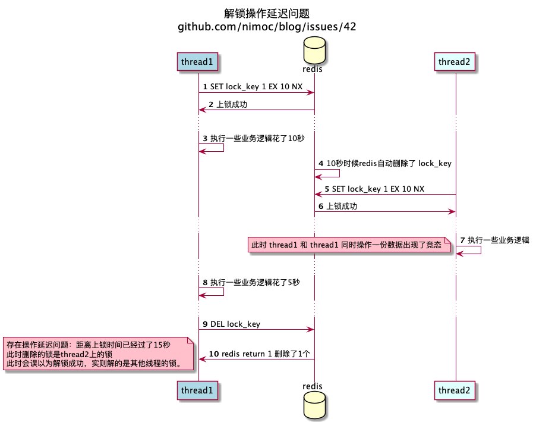
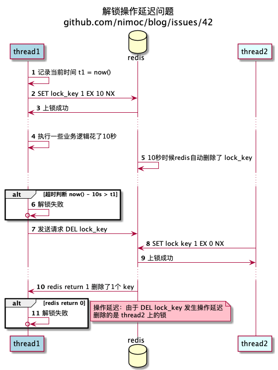
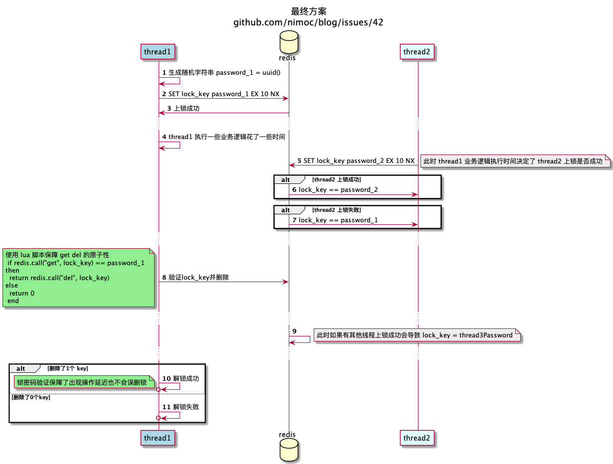
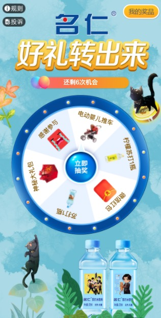
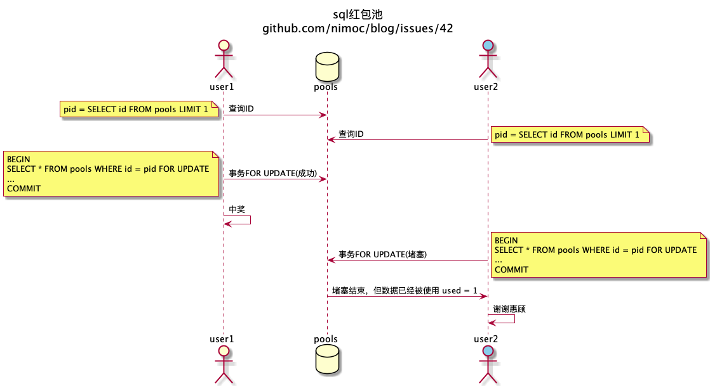

----
title: 解决并发方法论
date: 2021-02-27
tags:
- 后端
- 并发
issues: 42
----

# 解决并发方法论

[](https://nimoc.io/notice/)

首先记住以下几点

1. **原子性**：确认哪些操作不是原子性，考虑不是原子性会导致什么问题。并考虑所有操作都可能失败或进程/协程中断
2. **操作延迟**：代码中每个操作的执行时间都是不确定的。每一行之间都可能出现非常大的延迟，需假设每行代码之间都有 sleep 操作。网络io中客户端收到消息的时间距离服务端发送消息已经过了很久，需假设:0s client 发起请求-> 2s server 接收请求 -> 4s server 响应数据 -> 6s client 接收响应
3. **竞态**：考虑会有其他线程/协程/同一时间对数据进行修改
4. 通过时序图分析问题 https://plantuml.com/zh/

## 互斥锁

以 redis 互斥锁为案例实现上述方法论：

先看一下不严谨的上锁操作会产生的问题


可以通过 SET key value  EX seconds NX 保证原子性


上锁操作已经解决了原子性问题，接下来看不严谨的解锁操作会产生的问题




为了解决延迟导致的错误解锁，通过不严谨的超时判断解决问题

> 请先不要看红色注释框,自己分析存在的问题。然后查看红色注释框确认答案



在上锁时设置密码，在解锁时验证密码以避免删除了别人的锁



## sql红包池

考虑如下业务场景：



每访问4次页面（UV）会产生一个微信红包在红包池中，点击立即抽奖时候会查询红包池。

红包池是基于一张表实现的，表结构如下

```sql
CREATE TABLE `pools` (
  `id` char(36) COLLATE utf8mb4_unicode_ci NOT NULL COMMENT 'uuid',
  `used` tinyint(4) NOT NULL DEFAULT '0' COMMENT '是否已使用',
  `amount` decimal(11,2) NOT NULL DEFAULT '0.00' COMMENT '金额',
  `owner_key` char(36) COLLATE utf8mb4_unicode_ci NOT NULL DEFAULT '' COMMENT '',
  `deleted_at` timestamp NULL DEFAULT NULL,
  `created_at` timestamp NULL DEFAULT NULL,
  `updated_at` timestamp NULL DEFAULT NULL,
  PRIMARY KEY (`id`),
  KEY `owner_key` (`owner_key`),
) ENGINE=InnoDB DEFAULT CHARSET=utf8mb4 COLLATE=utf8mb4_unicode_ci;
```

> 因涉及公司部分业务细节，表已经做过简化。

关键字段是：`used` `amount`

例如数据内容为：

```
id,used,amount,owner_key
1,0,0.3,""
2,0,0.3,""
3,0,0.3,""
```


此处不要使用事务 for update 加锁去操作数据。
例如三个用户请求一起进入查询，会全部去尝试给 id:1 上锁，只有一个请求能上锁成功。
其余2个请求都会失败。



采用 **CAS** (Compare And Swap)乐观锁和**数据标记** `owner_key`来实现。

伪代码如下

```js
function luckyDraw() {
  // 正式代码不要将参数写在sql中，要防止依赖注入
  ownerKey = uuid()
  rowsAffected = sql("UPDATE pools SET used=1, owner_key = ${ownerKey}  WHERE used = 0 LIMIT 1")
  // 如果sql不支持 rowsAffected 可以基于 ownerKey 再查询一次判断修改是否成功
  if (rowsAffected == 0) {
    return "谢谢惠顾"
  }
  data = sql("SELECT * FROM pools WHERE ownerKey = ${ownerKey} AND used=1 LIMIT 1")
  return "中奖了，发放" + data.amount + "元！"
}
```

> 上面的伪代码没有做防御式编程，实际代码应该判断 rowsAffected > 1 和 data 没查到的情况

SQL UPDATE 是原子性操作，所以极限并发情况下，一万个请求在一秒内写入DB，只有3个请求会写入成功，其他请求均反馈 rowsAffected = 0。

> 如果加上 order by 就能在sql中模拟栈和队列。

TODO:解锁失败后锁回滚，心跳续命锁，etcd分布式锁

原文地址 https://github.com/nimoc/blog/issues/42 (原文持续更新)
